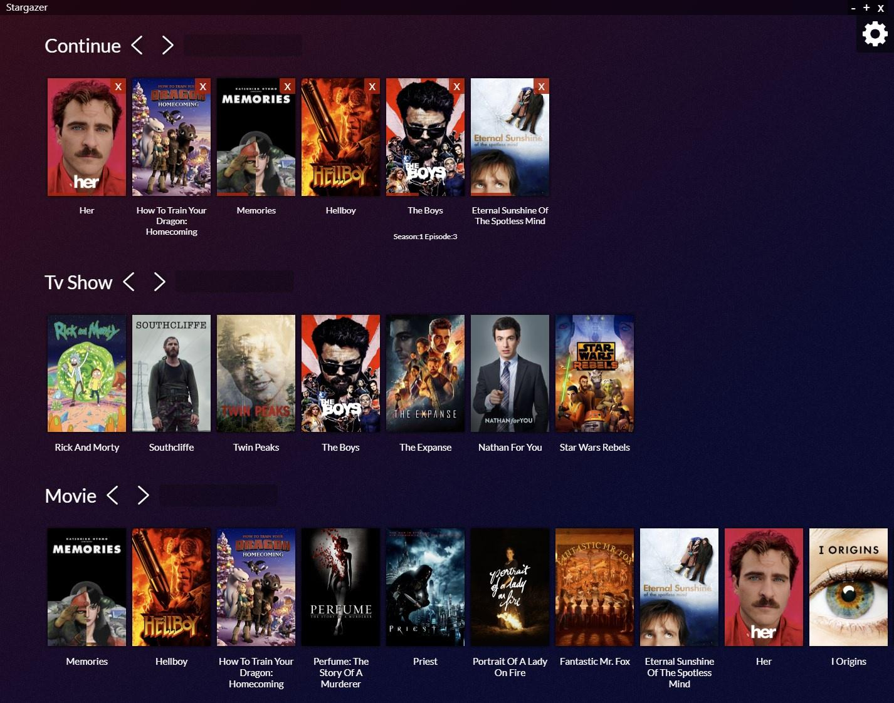

# Stargazer

stargazer is library managing software that automaticaly parse all the video files of a submited directory and order them according to their type while fetching related info via TMDB api.

**a TMDB api key is needed to work properly**
